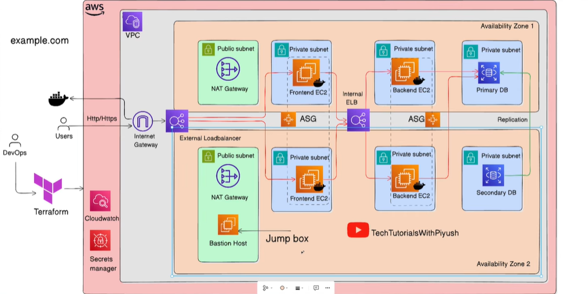

# AWS Three-Tier Web Application with Terraform

This project provisions a production-style three-tier web application architecture on AWS using Terraform. The infrastructure is designed around high availability, network isolation, controlled access, and horizontal scalability.

The sample application for this infrastructure is a minimal Feedback Collector:

- Frontend: simple React application
- Backend: Go API using the Chi router
- Database: PostgreSQL
- Runtime: Docker containers
- Database bootstrap: SQL init script

## Architecture



The architecture is split across multiple Availability Zones and follows a layered design:

### Tier 1: Presentation Layer

The presentation layer serves public web traffic.

- Public-facing Application Load Balancer
- Frontend EC2 instances running the React application container
- Auto Scaling Group for frontend instances
- Instances distributed across multiple Availability Zones

Users access the application over HTTP/HTTPS through the external load balancer. The frontend communicates with the backend API through the internal application layer.

### Tier 2: Logic Layer

The logic layer runs private backend services.

- Internal Application Load Balancer
- Backend EC2 instances running the Go + Chi API container
- Auto Scaling Group for backend instances
- Private subnets only

The backend exposes application APIs such as:

- `GET /health`
- `POST /api/feedback`
- `GET /api/feedback`

The backend tier is not directly exposed to the internet.

### Tier 3: Data Layer

The data layer stores application data in PostgreSQL.

- Amazon RDS for PostgreSQL
- Private database subnets
- Primary database with standby/replica setup for high availability
- Security group access restricted to the backend tier

The Feedback Collector stores submitted feedback records in PostgreSQL.

## Infrastructure Components

This project is expected to include the following AWS resources:

- VPC
- Public subnets across multiple Availability Zones
- Private application subnets across multiple Availability Zones
- Private database subnets across multiple Availability Zones
- Internet Gateway
- NAT Gateways for private subnet outbound access
- External Application Load Balancer
- Internal Application Load Balancer
- EC2 instances for frontend and backend workloads
- Auto Scaling Groups
- Bastion host for controlled SSH access
- RDS PostgreSQL database
- Security groups for each tier
- CloudWatch metrics and alarms for scaling
- AWS Secrets Manager for sensitive values

## Application Overview

The Feedback Collector is intentionally small so the focus stays on infrastructure behavior.

Basic flow:

1. A user opens the React frontend through the public load balancer.
2. The frontend submits feedback to the Go backend API.
3. The backend validates the request and writes the record to PostgreSQL.
4. The backend can return recent feedback records to the frontend.

Example database table:

```sql
CREATE TABLE feedback (
  id BIGSERIAL PRIMARY KEY,
  name TEXT NOT NULL,
  email TEXT NOT NULL,
  message TEXT NOT NULL,
  created_at TIMESTAMPTZ NOT NULL DEFAULT NOW()
);
```

## Planned Repository Structure

```text
.
├── app/
│   ├── frontend/
│   ├── backend/
│   └── db/
│       └── init.sql
├── assets/
│   └── img.png
├── terraform/
│   ├── environments/
│   │   └── dev/
│   └── modules/
│       ├── vpc/
│       ├── security-groups/
│       ├── alb/
│       ├── compute/
│       ├── rds/
│       ├── bastion/
│       └── monitoring/
├── docker-compose.yml
└── README.md
```

The exact structure may evolve as the Terraform modules and application code are implemented.

## Local Development Setup

To replicate this project locally, clone the repository and run the application stack with Docker.

Prerequisites:

- Git
- Docker
- Docker Compose
- Go
- Node.js and npm
- Terraform CLI
- AWS CLI configured with valid credentials, if provisioning AWS infrastructure

Clone the repository:

```bash
git clone https://github.com/<your-username>/aws_three_tier_webapp_terraform.git
cd aws_three_tier_webapp_terraform
```

Start the local application stack:

```bash
docker compose up --build
```

The local stack is expected to run:

- React frontend container
- Go backend API container
- PostgreSQL database container initialized with `app/db/init.sql`

Useful local endpoints:

- Frontend: `http://localhost:3000`
- Backend health check: `http://localhost:8080/health`
- Backend API: `http://localhost:8080/api/feedback`
- PostgreSQL: `localhost:5432`

Stop the local stack:

```bash
docker compose down
```

Remove local containers, networks, and database volume:

```bash
docker compose down -v
```

## Terraform Workflow

From the target environment directory:

```bash
terraform init
terraform fmt -recursive
terraform validate
terraform plan
terraform apply
```

For cleanup:

```bash
terraform destroy
```

## Security Model

Network access is restricted by tier:

- Internet traffic can reach only the external load balancer.
- Frontend instances receive traffic from the external load balancer.
- Backend instances receive traffic from the internal load balancer.
- PostgreSQL accepts traffic only from the backend security group.
- SSH access to private instances is routed through the bastion host.
- Private subnets use NAT Gateways for outbound internet access.
- Secrets should be stored in AWS Secrets Manager instead of hardcoded in Terraform or application code.
